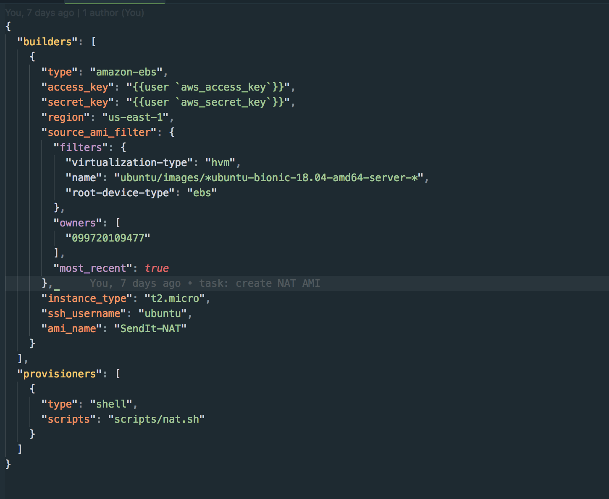

# Create a Custom Network for your Checkpoint

## Technologies Used
- [Packer](https://packer.io/downloads.html)
- [Terraform](https://www.terraform.io/)
- [Ansible](https://aws.amazon.com/)
- [AWS](https://aws.amazon.com/)

## Introduction
This repository automates the creation of a VPC(Virtual Private Cloud), a Public and Private subnet, Internet gateway, NAT instance, Route tables e.t.c. The application backend (API) and database reside in a private subnet(not accessible via the internet) while the frontend resides in a public subnet (accessible via the internet).

In this repo, there are four packer files, for the frontend, backend, database and NAT instance respectively. These packer files are used to build and provision the AMIs we would use as base images for our instances.

### Packer file for the database 


This file builds an AMI for the database instance and provisons it with the `postgres.yml` file found in the **ansible** folder. The `postgres.yml` file installs postgres (the database the application uses), creates a new database and edits the configuration file to allow remote connections to the database.

### Packer file for the frontend


This file builds an AMI for the frontend instance and provisons it with the `frontend.yml` file found in the **ansible** folder. The `frontend.yml` file updates the Ubuntu AMI, clone the repo hosting the frontend app and installs some necessary packages like nodejs, certbot, pm2, etc. I included several descriptive comments in the playbook to explain each task and what it does.
The packages installed are:
- [PM2](https://www.npmjs.com/package/pm2) is a process manager for the JavaScript runtime Node.js. It allows you to keep applications alive forever, to reload them without downtime and to facilitate common system admin tasks. I chose this because my application is written with nodeJs and javascript.
- [Let’s Encrypt](https://letsencrypt.org/) is designed to provide free, automated, and open security certificate authority (CA) for everyone. It enables website owners to get security certificates within minutes.
- [Certbot](https://certbot.eff.org/) automatically enables HTTPS on your website with EFF's Certbot, deploying Let's Encrypt certificates.
- [Nginx](https://www.linode.com/docs/web-servers/nginx/use-nginx-reverse-proxy/) A reverse proxy is a server that sits between internal applications and external clients, forwarding client requests to the appropriate server. While many common applications, such as Node.js, are able to function as servers on their own, NGINX has a number of advanced load balancing, security, and acceleration features that most specialized applications lack. Using NGINX as a reverse proxy enables you to add these features to any application.

### Packer file for the backend


This file builds an AMI for the frontend instance and provisons it with the `api.yml` file found in the **ansible** folder. The `api.yml` file updates the Ubuntu AMI, clone the repo hosting the backend app and installs the same packages as with the frontend application.

### Packer file for the NAT instance


This file builds an AMI for the NAT instance and provisons it with the `nat.sh` script found in the **scripts** folder. The `nat.sh` file enables **IPv4 forwarding** and **Masquerade** for this instance. This is necessary to enable this instance serve as a **NAT gateway**, forwarding traffic from instances in a private subnet to the iternet but not allowing traffic from the internet to the private subnet.

After the AMIs have been built and provisioned, **terraform** is used to automatically build our infrastructure. Terraform configuration is described using a high-level configuration syntax. The terraform configurations can be found in the **terraform** folder.

### Variables file


This file holds all the variables used by this terraform configuration. It also provides a default value that is used if no value was provided. The `AWS_ACCESS_KEY_ID` and the `AWS_SECRET_ACCESS_KEY` variables hold the aws authentication keys of the aws account you want to use to build your infrastructure.

### Vpc file


This file holds configurations used to create a **VPC**- A Virtual Private Cloud (VPC) lets you provision a logically isolated section of the AWS Cloud where you can launch AWS resources in a virtual network that you define. It also holds the configuration that creates the **private** and **public** subnet. A subnet is a logical partition of an IP network into multiple, smaller network segments. It is typically used to subdivide large networks into smaller, more efficient subnetworks. Route tables are also created to define how traffic would be routed from each subnet. Traffic from the Public subnet would be routed to the **internet gateway** while traffic from the Private subnet routed to the **NAT instance**. **Route table associations** are used to associate each route table to a specific subnet. All these configurations are declared and described in this file. *There are descriptive comments that would help you understand each code block*.

### Security groups
The **security group** acts as a virtual **firewall** for your instance to control **inbound and outbound** traffic. When you launch an instance in a VPC, you can assign up to five security groups to the instance. 
In this file we declare security groups for the 
**priavte subnet**:

```
resource "aws_security_group" "private" {
  name        = "sendit_private_sg"
  description = "Security group for private instances"

  ingress {
    from_port   = 80
    to_port     = 80
    protocol    = "tcp"
    security_groups = ["${aws_security_group.private_elb.id}"]
  }

  ingress {
    from_port   = 22
    to_port     = 22
    protocol    = "tcp"
    cidr_blocks = ["${aws_instance.nat.private_ip}/32"]
  }

  ingress {
    from_port   = 3000
    to_port     = 3000
    protocol    = "tcp"
    cidr_blocks = ["${var.cidr_public_subnet}"]
  }

  ingress {
    from_port = -1
    to_port = -1
    protocol = "icmp"
    cidr_blocks = ["${var.cidr_vpc}"]
  }

  egress {
    from_port   = 0
    to_port     = 0
    protocol    = "-1"
    cidr_blocks = ["${var.cidr_public_subnet}"]
  }

  egress {
    from_port = -1
    to_port = -1
    protocol = "icmp"
    cidr_blocks = ["0.0.0.0/0"]
  }

  vpc_id = "${aws_vpc.main.id}"

  tags {
    Name = "sendit_private_sg"
  }
}
```
This allows **http** traffic on port `80` only from the **private Load Balancer**, **ssh** traffic on port `22` only from the **NAT** instance, traffic on port `3000` only from the **public subnet**, and it allows outgoing traffic only to the public subnet. This rule secures our private instances in the private subnet to make sure they are not accessible from outside the public subnet.

**public subnet**

```
resource "aws_security_group" "public" {
  name        = "sendit_public_sg"
  description = "Security group for public instances"

  ingress {
    from_port   = 80
    to_port     = 80
    protocol    = "tcp"
    security_groups = ["${aws_security_group.public_elb.id}"]
  }

  ingress {
    from_port   = 22
    to_port     = 22
    protocol    = "tcp"
    cidr_blocks = ["${aws_instance.nat.private_ip}/32"]
  }

  ingress {
    from_port   = 3000
    to_port     = 3000
    protocol    = "tcp"
    cidr_blocks = ["0.0.0.0/0"]
  }

  ingress {
    from_port = -1
    to_port = -1
    protocol = "icmp"
    cidr_blocks = ["0.0.0.0/0"]
  }

  egress {
    from_port   = 0
    to_port     = 0
    protocol    = "-1"
    cidr_blocks = ["0.0.0.0/0"]
  }

  vpc_id = "${aws_vpc.main.id}"

  tags {
    Name = "sendit_public_sg"
  }
}
```
Since the public subnet hosts our frontend application, it is to be accessible from anywhere. Hence we allow traffic in and out from anywhere but **ssh** only from the **NAT** instance which also serves as a **bastion host** or **jumpbox**.

**databse**

```
resource "aws_security_group" "database" {
  name        = "sendit_database_sg"
  description = "Security group for database instances"

  ingress {
    from_port   = 22
    to_port     = 22
    protocol    = "tcp"
    cidr_blocks = ["${aws_instance.nat.private_ip}/32"]
  }

  ingress {
    from_port   = 5432
    to_port     = 5432
    protocol    = "tcp"
    cidr_blocks = ["${var.cidr_private_subnet}"]
  }

  ingress {
    from_port = -1
    to_port = -1
    protocol = "icmp"
    cidr_blocks = ["${var.cidr_vpc}"]
  }

  egress {
    from_port   = 0
    to_port     = 0
    protocol    = "-1"
    cidr_blocks = ["${var.cidr_private_subnet}"]
  }

  egress {
    from_port = -1
    to_port = -1
    protocol = "icmp"
    cidr_blocks = ["0.0.0.0/0"]
  }

  vpc_id = "${aws_vpc.main.id}"

  tags {
    Name = "sendit_database_sg"
  }
}
```
The database security group only allows **ssh** from the **NAT instance** and traffic on port `5432` from the private subnet. This way it is not accessible from anywhere outside the priavte subnet.

**Private (internal-facing) loadbalancer**

```
resource "aws_security_group" "private_elb" {
  name        = "sendit_private_elb_sg"
  description = "Security group for the private Elastic load balancer"

  # inbound traffic
  ingress {
    from_port   = 80
    to_port     = 80
    protocol    = "tcp"
    cidr_blocks = ["172.16.0.0/16"]
  }

  vpc_id = "${aws_vpc.main.id}"

  tags = {
    Name = "sendit_private_elb_sg"
  }
}

# this rule depends on both security groups so separating it allows it
# to be created after both
resource "aws_security_group_rule" "extra_rule1" {
  security_group_id        = "${aws_security_group.private_elb.id}"
  from_port                = 80
  to_port                  = 80
  protocol                 = "tcp"
  type                     = "egress"
  source_security_group_id = "${aws_security_group.private.id}"
}
```
A **load balancer** is a device that distributes network or application traffic across a cluster of servers. Load balancing improves responsiveness and increases availability of applications.
This security group is for an internal-facing/private loadbalancer which serves the backend instance. This security group allows http traffic from instances in the VPC. This way the **backend** can only be accessed from the **private loadbalancer** and it in turn can only be accessed from within the VPC.

**Public loadbalancer**

```
resource "aws_security_group" "public_elb" {
  name        = "sendit_public_elb_sg"
  description = "Security group for the public Elastic load balancer"

  # inbound traffic
  ingress {
    from_port   = 80
    to_port     = 80
    protocol    = "tcp"
    cidr_blocks = ["0.0.0.0/0"]
  }

  vpc_id = "${aws_vpc.main.id}"

  tags = {
    Name = "sendit_public_elb_sg"
  }
}

resource "aws_security_group_rule" "extra_rule2" {
  security_group_id        = "${aws_security_group.public_elb.id}"
  from_port                = 80
  to_port                  = 80
  protocol                 = "tcp"
  type                     = "egress"
  source_security_group_id = "${aws_security_group.public.id}"
}
```
This loadbalancer serves the frontend application and allows traffic to and fro anywhere.

**NAT instance**

```
resource "aws_security_group" "nat" {
    name = "sendit_vpc_nat"
    description = "Allow traffic to pass from the private subnet to the internet"

    ingress {
        from_port = 80
        to_port = 80
        protocol = "tcp"
        cidr_blocks = ["${var.cidr_private_subnet}"]
    }
    ingress {
        from_port = 443
        to_port = 443
        protocol = "tcp"
        cidr_blocks = ["${var.cidr_private_subnet}"]
    }
    ingress {
      from_port   = 22
      to_port     = 22
      protocol    = "tcp"
      cidr_blocks = ["0.0.0.0/0"]
    }

    ingress {
      from_port = -1
      to_port = -1
      protocol = "icmp"
      cidr_blocks = ["${var.cidr_private_subnet}"]
    }


    egress {
        from_port = 80
        to_port = 80
        protocol = "tcp"
        cidr_blocks = ["0.0.0.0/0"]
    }
    egress {
        from_port = 443
        to_port = 443
        protocol = "tcp"
        cidr_blocks = ["0.0.0.0/0"]
    }

    egress {
      from_port = 22
      to_port = 22
      protocol = "tcp"
      cidr_blocks = ["${var.cidr_vpc}"]
    }

    egress {
      from_port   = -1
      to_port     = -1
      protocol    = "icmp"
      cidr_blocks = ["0.0.0.0/0"]
    }

    vpc_id = "${aws_vpc.main.id}"

    tags {
        Name = "sendit_nat_sg"
    }
}
```
The **NAT instance** security group allows traffic from the private subnet and sends it out to the internet but doesn't allow traffic into the priavte subnet.

### NAT instance


This file creates an instance from the AMI which would have been built with packer earlier. It is assigned a **public address**, put in the **public subnet** and given its own **security group**.

### Elastic Load balancer


This file creates two loadbalancers, one priavte load balancer for the private subnet and one public load balancer for the public subnet, associates them with their respective instances and configures the **listener** and **health checks**.

### Data


The data used to source for the ami that was created with packer, is specified in this file. Filters are used to filter by **name** from a list of AMIs owned by the account specified in `owners`. The AMIs gotten are then used to launch the various instances.

### Instances


This file creates the various instances from the AMIs built earlier with packer. It assigns them to the **VPC** and to their respective **subnets** and **security groups**.

## Getting started
1) Install **packer** and **terraform**.
2) In the `terraform` folder, create a `terraform.tfvars` file that contains your `AWS_ACCESS_KEY_ID`, `AWS_SECRET_ACCESS_KEY` and `key_pair` in this format:

```
AWS_ACCESS_KEY_ID = "**********"
AWS_SECRET_ACCESS_KEY = "************"
key_pair = "************"
```
3) In the **root directory**, create a `variables.json` file. This file would contain the variables that packer would use to build the AMIs.

```
{
  "aws_access_key": "**********",
  "aws_secret_key": "**********"
}
```
4) After creating the needed variable files for packer and terraform, `cd` into the **scripts** directory by running `cd scripts`
5) Run `chmod +x deploy.sh` to make the `deploy.sh` script executable.
6) Proceed to run the script that automates all the process of building the AMIs and building the infrastructure by running `./deploy.sh`.

At the end of the script if all goes well, you would have four AMIs built and all your terraform resources built on AWS.
The frontend application can be accessed from the **public laodbalancer** and the backend from the **private laodbalancer** 
Congratulations, you have successfully deployed an application to a VPC on AWS.


